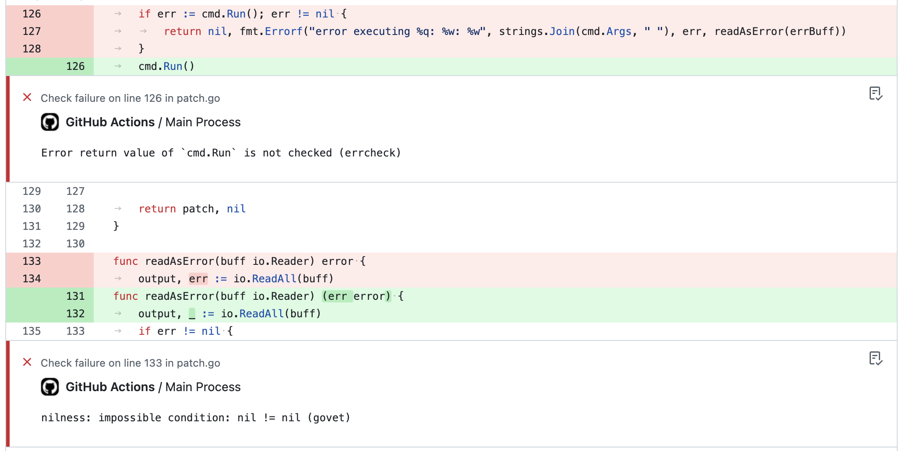

# golangci-lint-action

[](https://github.com/golangci/golangci-lint-action/actions)

It's the official GitHub action for [golangci-lint](https://github.com/golangci/golangci-lint) from it's authors.
The action runs [golangci-lint](https://github.com/golangci/golangci-lint) and reports issues from linters.



## Compatibility

* `v2.0.0+` works with `golangci-lint` version >= `v1.28.3`
* `v1.2.2` is deprecated due to we forgot to change the minimum version of `golangci-lint` to `v1.28.3` ([issue](https://github.com/golangci/golangci-lint-action/issues/39))
* `v1.2.1` works with `golangci-lint` version >= `v1.14.0` ([issue](https://github.com/golangci/golangci-lint-action/issues/39))

## How to use

Add `.github/workflows/golangci-lint.yml` with the following contents:

```yaml
name: golangci-lint
on:
  push:
    tags:
      - v*
    branches:
      - master
      - main
  pull_request:
jobs:
  golangci:
    name: lint
    runs-on: ubuntu-latest
    steps:
      - uses: actions/checkout@v2
      - name: golangci-lint
        uses: golangci/golangci-lint-action@v2
        with:
          # Required: the version of golangci-lint is required and must be specified without patch version: we always use the latest patch version.
          version: v1.29

          # Optional: working directory, useful for monorepos
          # working-directory: somedir

          # Optional: golangci-lint command line arguments.
          # args: --issues-exit-code=0

          # Optional: show only new issues if it's a pull request. The default value is `false`.
          # only-new-issues: true
```

We recommend running this action in a job separate from other jobs (`go test`, etc)
because different jobs [run in parallel](https://help.github.com/en/actions/getting-started-with-github-actions/core-concepts-for-github-actions#job).

### Multiple OS Support

If you need to run linters for specific operating systems, you will need to use `v2` of the action.  Here is a sample configuration file:

```yaml
name: golangci-lint
on:
  push:
    tags:
      - v*
    branches:
      - master
      - main
  pull_request:
jobs:
  golangci:
    strategy:
      matrix:
        go-version: [1.15.x]
        os: [macos-latest, windows-latest]
    name: lint
    runs-on: ${{ matrix.os }}
    steps:
      - uses: actions/checkout@v2
      - name: golangci-lint
        uses: golangci/golangci-lint-action@v2
        with:
          # Required: the version of golangci-lint is required and must be specified without patch version: we always use the latest patch version.
          version: v1.29
          # Optional: working directory, useful for monorepos
          # working-directory: somedir

          # Optional: golangci-lint command line arguments.
          # args: --issues-exit-code=0

          # Optional: show only new issues if it's a pull request. The default value is `false`.
          # only-new-issues: true
```

You will also likely need to add the following `.gitattributes` file to ensure that line endings for windows builds are properly formatted:

```.gitattributes
*.go text eol=lf 
```

## Comments and Annotations

Currently, GitHub parses the action's output and creates [annotations](https://github.community/t5/GitHub-Actions/What-are-annotations/td-p/30770).

The restrictions of annotations are the following:

1. Currently, they don't support markdown formatting (see the [feature request](https://github.community/t5/GitHub-API-Development-and/Checks-Ability-to-include-Markdown-in-line-annotations/m-p/56704))
2. They aren't shown in list of comments like it was with [golangci.com](https://golangci.com). If you would like to have comments - please, up-vote [the issue](https://github.com/golangci/golangci-lint-action/issues/5).

## Performance

The action was implemented with performance in mind:

1. We cache data by [@actions/cache](https://github.com/actions/toolkit/tree/master/packages/cache) between builds: Go build cache, Go modules cache, golangci-lint analysis cache.
2. We don't use Docker because image pulling is slow.
3. We do as much as we can in parallel, e.g. we download cache, go and golangci-lint binary in parallel.

For example, in a repository of [golangci-lint](https://github.com/golangci/golangci-lint) running this action without the cache takes 50s, but with cache takes 14s:
  * in parallel:
    * 13s to download Go
    * 4s to restore 50 MB of cache
    * 1s to find and install `golangci-lint`
  * 1s to run `golangci-lint` (it takes 35s without cache)

## Internals

We use JavaScript-based action. We don't use Docker-based action because:

1. docker pulling is slow currently
2. it's easier to use caching from [@actions/cache](https://github.com/actions/toolkit/tree/master/packages/cache)

We support different platforms, such as `ubuntu`, `macos` and `windows` with `x32` and `x64` archs.

Inside our action we perform 3 steps:

1. Setup environment running in parallel:
  * restore [cache](https://github.com/actions/cache) of previous analyzes
  * fetch [action config](https://github.com/golangci/golangci-lint/blob/master/assets/github-action-config.json) and find the latest `golangci-lint` patch version
    for needed version (users of this action can specify only minor version of `golangci-lint`). After that install [golangci-lint](https://github.com/golangci/golangci-lint) using [@actions/tool-cache](https://github.com/actions/toolkit/tree/master/packages/tool-cache)
  * install the latest Go 1.x version using [@actions/setup-go](https://github.com/actions/setup-go)
2. Run `golangci-lint` with specified by user `args`
3. Save cache for later builds

### Caching internals

1. We save and restore the following directories: `~/.cache/golangci-lint`, `~/.cache/go-build`, `~/go/pkg`.
2. The primary caching key looks like `golangci-lint.cache-{platform-arch}-{interval_number}-{go.mod_hash}`. Interval number ensures that we periodically invalidate
   our cache (every 7 days). `go.mod` hash ensures that we invalidate the cache early - as soon as dependencies have changed.
3. We use [restore keys](https://help.github.com/en/actions/configuring-and-managing-workflows/caching-dependencies-to-speed-up-workflows#matching-a-cache-key): `golangci-lint.cache-{interval_number}-`, `golangci-lint.cache-`. GitHub matches keys by prefix if we have no exact match for the primary cache.

This scheme is basic and needs improvements. Pull requests and ideas are welcome.

## Development of this action

1. Install [act](https://github.com/nektos/act#installation)
2. Make a symlink for `act` to work properly: `ln -s . golangci-lint-action`
3. Prepare deps once: `npm run prepare-deps`
4. Run `npm run local` after any change to test it
